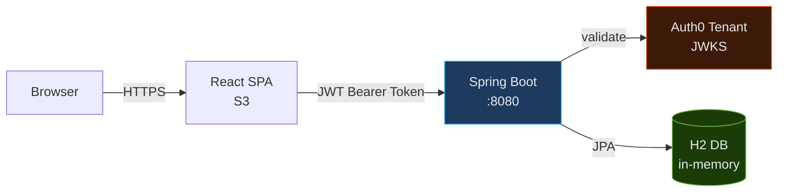
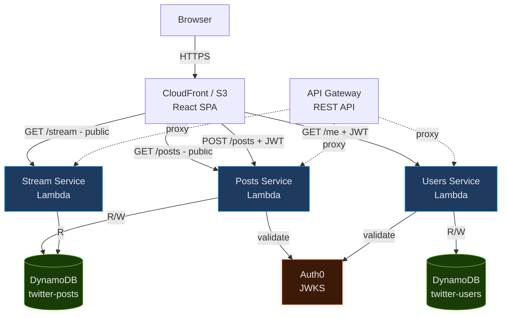
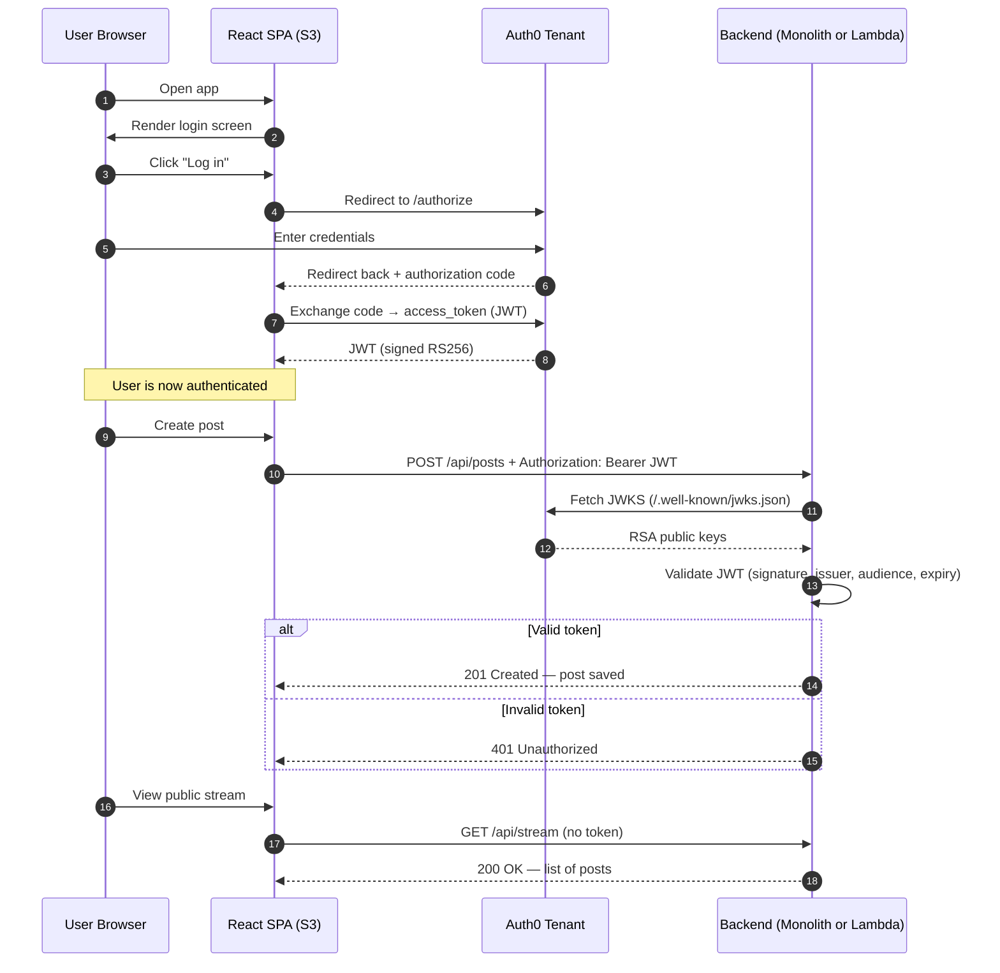
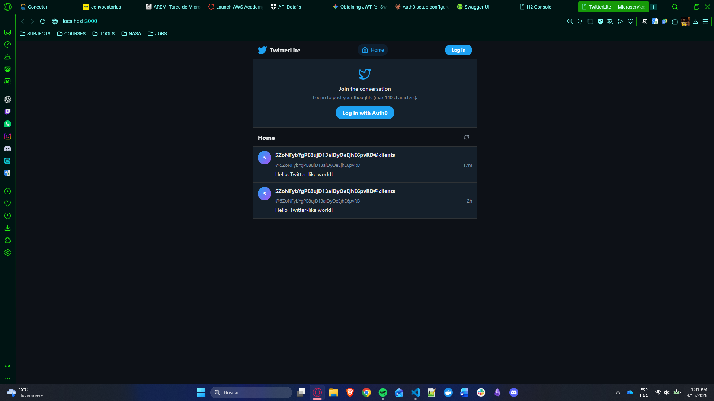
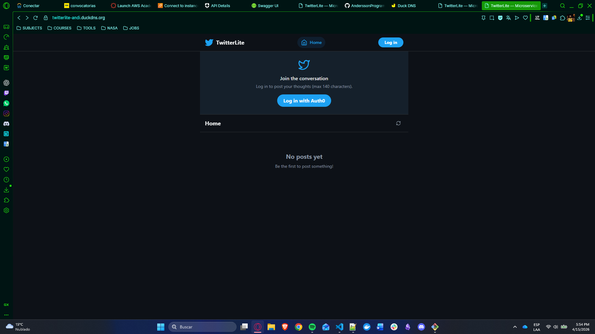
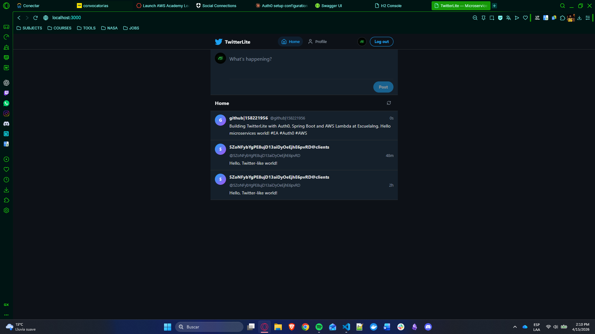
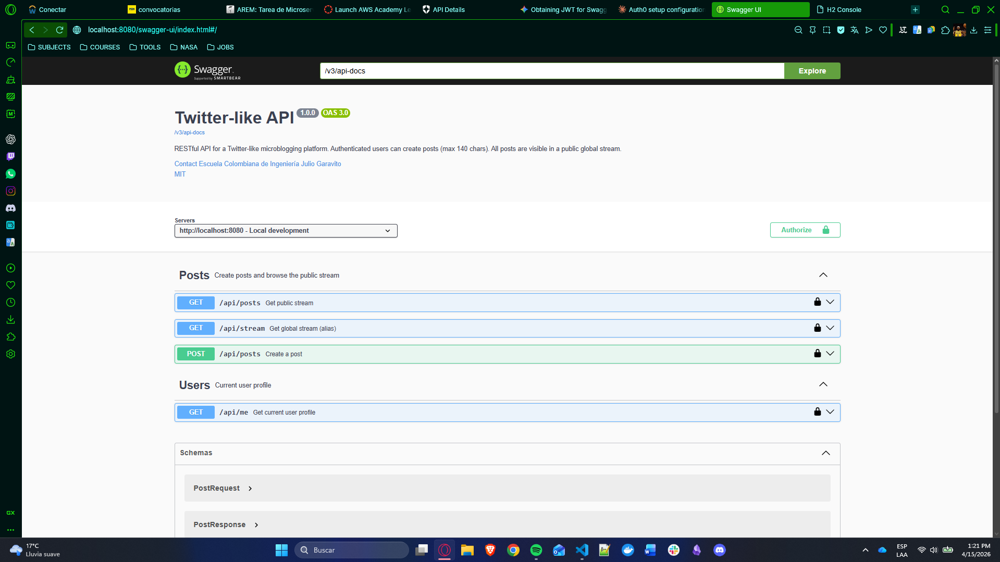
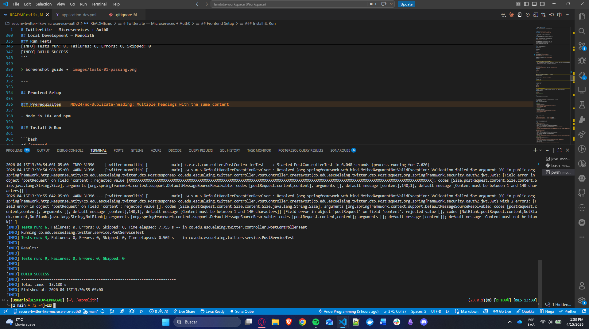
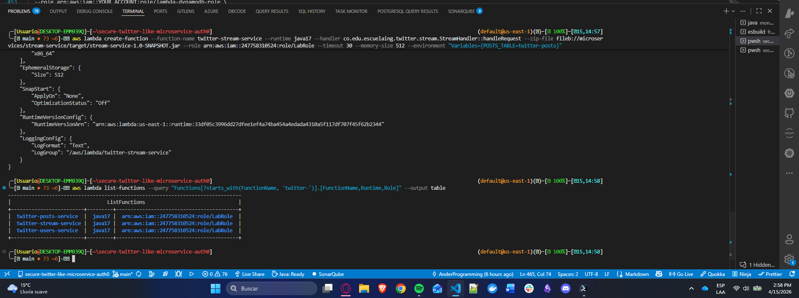
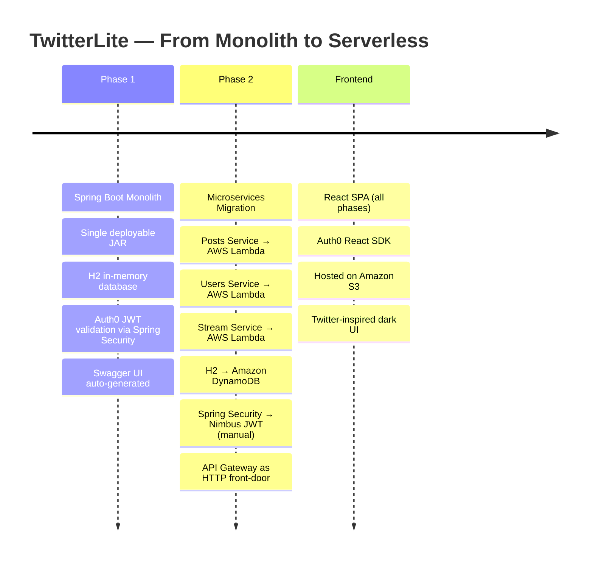

# TwitterLite — Microservices + Auth0


---

> **Building a Secure Twitter-like Application with Microservices and Auth0**
> *Escuela Colombiana de Ingeniería Julio Garavito — Enterprise Architectures*

A fully functional microblogging platform that evolves from a **Spring Boot monolith** into **serverless AWS Lambda microservices**, secured end-to-end with **Auth0 JWT tokens**. Users can log in, post messages (≤ 140 chars), and browse the global public stream.

---

## Quick Navigation

1. [Live Demo](#live-demo)
2. [Architecture Overview](#architecture-overview)
3. [Tech Stack](#tech-stack)
4. [Repository Structure](#repository-structure)
5. [Auth0 Setup Guide](#auth0-setup-guide)
6. [Local Development — Monolith](#local-development--monolith)
7. [Frontend Setup](#frontend-setup)
8. [AWS Lambda Microservices Deployment](#aws-lambda-microservices-deployment)
9. [S3 Frontend Deployment](#s3-frontend-deployment)
10. [API Reference](#api-reference)
11. [Tests](#tests)
12. [Evidence Gallery](#evidence-gallery)
13. [Video Walkthrough](#video-walkthrough)
14. [Architecture Evolution](#architecture-evolution)

---

## Live Demo

| Resource | URL |
|---|---|
| Frontend (S3) | `http://YOUR-BUCKET.s3-website-us-east-1.amazonaws.com` |
| Monolith Swagger UI | `http://localhost:8080/swagger-ui/index.html` |
| Posts Lambda | `https://YOUR-API-ID.execute-api.us-east-1.amazonaws.com/prod/posts` |
| Users Lambda | `https://YOUR-API-ID.execute-api.us-east-1.amazonaws.com/prod/me` |
| Stream Lambda | `https://YOUR-API-ID.execute-api.us-east-1.amazonaws.com/prod/stream` |

---

## Architecture Overview

### Phase 1 — Spring Boot Monolith



### Phase 2 — AWS Lambda Microservices



### Auth0 Security Flow



---

## Tech Stack

| Layer | Technology | Purpose |
|---|---|---|
| **Monolith** | Spring Boot 3.2, Java 17 | REST API, JPA, OAuth2 Resource Server |
| **Database (dev)** | H2 in-memory | Zero-config local dev |
| **API Docs** | SpringDoc OpenAPI 2.3 | Auto-generated Swagger UI |
| **Security** | Spring Security + Nimbus JWT | Auth0 token validation |
| **Microservices** | AWS Lambda (Java 17) | Serverless post/user/stream handlers |
| **NoSQL** | Amazon DynamoDB | Lambda data storage |
| **API Gateway** | AWS API Gateway REST | Lambda HTTP proxy |
| **Frontend** | React 18 + Vite | SPA |
| **Auth (frontend)** | Auth0 React SDK | Login, logout, token management |
| **Styling** | Tailwind CSS v3 | Twitter-inspired dark UI |
| **Hosting** | Amazon S3 | Static website |
| **CI/CD** | GitHub Actions | Build + test on every push |

---

## Repository Structure

```
secure-twitter-like-microservice-auth0/
├── README.md
├── .gitignore
├── images/                          ← screenshots for this README
│
├── monolith/                        ← Spring Boot monolith (Phase 1)
│   ├── pom.xml
│   └── src/
│       ├── main/java/co/edu/escuelaing/twitter/
│       │   ├── TwitterApplication.java
│       │   ├── config/
│       │   │   ├── SecurityConfig.java      ← OAuth2 Resource Server
│       │   │   ├── AudienceValidator.java   ← JWT audience check
│       │   │   └── OpenApiConfig.java       ← Swagger configuration
│       │   ├── entity/
│       │   │   ├── User.java
│       │   │   └── Post.java
│       │   ├── dto/
│       │   │   ├── PostRequest.java
│       │   │   ├── PostResponse.java
│       │   │   └── UserInfoDto.java
│       │   ├── repository/
│       │   │   ├── UserRepository.java
│       │   │   └── PostRepository.java
│       │   ├── service/
│       │   │   ├── UserService.java
│       │   │   └── PostService.java
│       │   └── controller/
│       │       ├── PostController.java      ← GET/POST /api/posts, GET /api/stream
│       │       └── UserController.java      ← GET /api/me
│       ├── main/resources/
│       │   └── application.yml
│       └── test/java/…
│           ├── service/PostServiceTest.java
│           └── controller/PostControllerTest.java
│
├── microservices/                   ← AWS Lambda microservices (Phase 2)
│   ├── posts-service/               ← GET+POST /posts
│   │   ├── pom.xml
│   │   └── src/main/java/co/edu/escuelaing/twitter/posts/
│   │       ├── PostHandler.java
│   │       ├── model/Post.java
│   │       └── util/JwtValidator.java
│   ├── users-service/               ← GET /me
│   │   ├── pom.xml
│   │   └── src/main/java/…/users/
│   │       ├── UserHandler.java
│   │       └── model/User.java
│   └── stream-service/              ← GET /stream
│       ├── pom.xml
│       └── src/main/java/…/stream/
│           ├── StreamHandler.java
│           └── model/StreamItem.java
│
└── frontend/                        ← React SPA (Auth0 React SDK)
    ├── package.json
    ├── vite.config.js
    ├── tailwind.config.js
    ├── index.html
    └── src/
        ├── main.jsx                 ← Auth0Provider bootstrap
        ├── App.jsx                  ← Router
        ├── auth0-config.js          ← domain / clientId / audience
        ├── index.css                ← Tailwind + custom classes
        ├── api/client.js            ← Axios API helpers
        └── components/
            ├── NavBar.jsx
            ├── Home.jsx
            ├── Stream.jsx           ← public feed
            ├── PostForm.jsx         ← create post (auth-gated)
            ├── PostCard.jsx
            ├── Profile.jsx          ← GET /api/me
            └── LoadingSpinner.jsx
```

---

## Auth0 Setup Guide

> **This section must be completed before running anything.** Auth0 is the identity provider for all JWT issuance and validation.

### Step 1 — Create an Auth0 Account and Tenant

1. Go to [auth0.com](https://auth0.com) → **Sign Up** (free tier is enough).
2. Create a new **tenant** (e.g. `dev-twitter-yourname`). Note the **domain**: `dev-twitter-yourname.us.auth0.com`.

### Step 2 — Create an API (Resource Server)

1. In the Auth0 Dashboard → **Applications → APIs → Create API**.
2. Fill in:
   - **Name**: `Twitter Lite API`
   - **Identifier (Audience)**: `https://twitter-api.yourname.com` ← remember this
   - **Signing Algorithm**: `RS256`
3. Under **Permissions**, add:
   - `read:posts` — Read public posts
   - `write:posts` — Create posts
   - `read:profile` — Read own profile
4. Save.

### Step 3 — Create a Single Page Application

1. **Applications → Create Application**.
2. Type: **Single Page Application** → Name: `Twitter Lite Frontend`.
3. In **Settings**:
   - **Allowed Callback URLs**: `http://localhost:3000, http://YOUR-BUCKET.s3-website-us-east-1.amazonaws.com`
   - **Allowed Logout URLs**: same
   - **Allowed Web Origins**: same
4. Save and note **Client ID**.

### Step 4 — Configure Monolith Environment Variables

Create `monolith/src/main/resources/application-dev.yml` (git-ignored):

```yaml
AUTH0_DOMAIN: dev-twitter-yourname.us.auth0.com
AUTH0_AUDIENCE: https://twitter-api.yourname.com
```

Or set environment variables before starting:

```bash
export AUTH0_DOMAIN=dev-twitter-yourname.us.auth0.com
export AUTH0_AUDIENCE=https://twitter-api.yourname.com
```

### Step 5 — Configure Frontend Environment Variables

Create `frontend/.env` (git-ignored):

```env
VITE_AUTH0_DOMAIN=dev-twitter-yourname.us.auth0.com
VITE_AUTH0_CLIENT_ID=YOUR_SPA_CLIENT_ID
VITE_AUTH0_AUDIENCE=https://twitter-api.yourname.com
VITE_API_BASE_URL=http://localhost:8080
```

---

## Local Development — Monolith

### Prerequisites

- Java 17+
- Maven 3.8+

### Run

```bash
cd monolith

# With env vars inline
$env:AUTH0_DOMAIN="dev-xxx.us.auth0.com" \
$env:AUTH0_AUDIENCE="https://twitter-api.yourname.com" \
mvn spring-boot:run
```

The API will be available at `http://localhost:8080`.

### Swagger UI

Open **http://localhost:8080/swagger-ui/index.html**

To test protected endpoints directly in Swagger:
1. Click **Authorize** (lock icon at the top right).
2. Paste a valid JWT access token from Auth0 (obtain one via the frontend login flow or via the Auth0 Management API).
3. Click **Authorize → Close**.
4. Try `POST /api/posts` — it will now include your Bearer token.

> Screenshot guide → `images/swagger-01-authorize.png`, `images/swagger-02-post.png`

### H2 Console (dev)

`http://localhost:8080/h2-console` — JDBC URL: `jdbc:h2:mem:twitterdb`

### Run Tests

```bash
cd monolith
mvn test
```

Expected output:

```
[INFO] Tests run: 8, Failures: 0, Errors: 0, Skipped: 0
[INFO] BUILD SUCCESS
```

> Screenshot guide → `images/tests-01-passing.png`

---

## Frontend Setup

### Prerequisites

- Node.js 18+ and npm

### Install & Run

```bash
cd frontend
npm install
npm run dev
```

Open **http://localhost:3000**

> Make sure the monolith is running on port 8080 — Vite proxies `/api` requests automatically.

### Build for Production

```bash
cd frontend
npm run build
# Output: frontend/dist/
```

---

## AWS Lambda Microservices Deployment

### Prerequisites

- AWS account with IAM permissions for Lambda, DynamoDB, and API Gateway
- AWS CLI configured (`aws configure`)
- Java 17+ and Maven

### Step 1 — Create DynamoDB Tables

```bash
# Posts table
aws dynamodb create-table \
  --table-name twitter-posts \
  --attribute-definitions AttributeName=postId,AttributeType=S \
  --key-schema AttributeName=postId,KeyType=HASH \
  --billing-mode PAY_PER_REQUEST \
  --region us-east-1

# Users table
aws dynamodb create-table \
  --table-name twitter-users \
  --attribute-definitions AttributeName=auth0Sub,AttributeType=S \
  --key-schema AttributeName=auth0Sub,KeyType=HASH \
  --billing-mode PAY_PER_REQUEST \
  --region us-east-1
```

> Screenshot guide → `images/aws-01-dynamodb-tables.png`

### Step 2 — Build Fat JARs

```bash
cd microservices/posts-service  && mvn clean package && cd ../..
cd microservices/users-service  && mvn clean package && cd ../..
cd microservices/stream-service && mvn clean package && cd ../..
```

Each produces a shaded JAR in `target/`.

### Step 3 — Create Lambda Functions

```bash
# Use your current AWS account id for role ARNs
ACCOUNT_ID=$(aws sts get-caller-identity --query Account --output text)

# Posts service
aws lambda create-function \
  --function-name twitter-posts-service \
  --runtime java17 \
  --handler co.edu.escuelaing.twitter.posts.PostHandler::handleRequest \
  --zip-file fileb://microservices/posts-service/target/posts-service-1.0-SNAPSHOT.jar \
  --role arn:aws:iam::$ACCOUNT_ID:role/LabRole \
  --timeout 30 \
  --memory-size 512 \
  --environment "Variables={POSTS_TABLE=twitter-posts,AUTH0_DOMAIN=dev-xxx.us.auth0.com,AUTH0_AUDIENCE=https://twitter-api.yourname.com}"

# Users service
aws lambda create-function \
  --function-name twitter-users-service \
  --runtime java17 \
  --handler co.edu.escuelaing.twitter.users.UserHandler::handleRequest \
  --zip-file fileb://microservices/users-service/target/users-service-1.0-SNAPSHOT.jar \
  --role arn:aws:iam::$ACCOUNT_ID:role/LabRole \
  --timeout 30 \
  --memory-size 512 \
  --environment "Variables={USERS_TABLE=twitter-users,AUTH0_DOMAIN=dev-xxx.us.auth0.com,AUTH0_AUDIENCE=https://twitter-api.yourname.com}"

# Stream service
aws lambda create-function \
  --function-name twitter-stream-service \
  --runtime java17 \
  --handler co.edu.escuelaing.twitter.stream.StreamHandler::handleRequest \
  --zip-file fileb://microservices/stream-service/target/stream-service-1.0-SNAPSHOT.jar \
  --role arn:aws:iam::$ACCOUNT_ID:role/LabRole \
  --timeout 30 \
  --memory-size 512 \
  --environment "Variables={POSTS_TABLE=twitter-posts}"
```

> Screenshot guide → `images/aws-02-lambda-functions.png`

### Step 4 — Create API Gateway

```bash
# Create REST API
aws apigateway create-rest-api --name "TwitterLiteAPI" --region us-east-1
# Note the returned `id` value — use it as API_ID below

# Get root resource ID
aws apigateway get-resources --rest-api-id YOUR_API_ID --region us-east-1
```

Then wire up the routes in the AWS Console:
- `GET /stream` → `twitter-stream-service`
- `GET /posts`  → `twitter-posts-service`
- `POST /posts` → `twitter-posts-service`
- `GET /me`     → `twitter-users-service`

Enable **CORS** on each resource and deploy to stage `prod`.

> Screenshot guide → `images/aws-03-api-gateway.png`

### Step 5 — IAM Role for Lambda

The Lambda functions need a role with this policy:

```json
{
  "Version": "2012-10-17",
  "Statement": [
    {
      "Effect": "Allow",
      "Action": [
        "dynamodb:GetItem",
        "dynamodb:PutItem",
        "dynamodb:Scan",
        "dynamodb:Query",
        "dynamodb:UpdateItem"
      ],
      "Resource": [
        "arn:aws:dynamodb:us-east-1:*:table/twitter-posts",
        "arn:aws:dynamodb:us-east-1:*:table/twitter-users"
      ]
    },
    {
      "Effect": "Allow",
      "Action": [
        "logs:CreateLogGroup",
        "logs:CreateLogStream",
        "logs:PutLogEvents"
      ],
      "Resource": "arn:aws:logs:*:*:*"
    }
  ]
}
```

If you are using a restricted lab account (for example AWS Academy Vocareum), you may get `AccessDenied` for `iam:CreateRole`.
In that case, use the pre-provisioned execution role (commonly `LabRole`) instead of creating `lambda-dynamodb-role`.

```bash
# Optional: verify current identity/account
aws sts get-caller-identity

# Optional: inspect if your role already has needed permissions
aws iam list-attached-role-policies --role-name LabRole
aws iam list-role-policies --role-name LabRole

# Re-point existing Lambda functions to LabRole
ACCOUNT_ID=$(aws sts get-caller-identity --query Account --output text)

aws lambda update-function-configuration \
  --function-name twitter-posts-service \
  --role arn:aws:iam::$ACCOUNT_ID:role/LabRole

aws lambda update-function-configuration \
  --function-name twitter-users-service \
  --role arn:aws:iam::$ACCOUNT_ID:role/LabRole

aws lambda update-function-configuration \
  --function-name twitter-stream-service \
  --role arn:aws:iam::$ACCOUNT_ID:role/LabRole
```

If IAM inspection commands are also denied, continue with `LabRole` and validate by invoking the endpoints and checking CloudWatch logs.

---

## S3 Frontend Deployment

```bash
# 0. Prepare production frontend environment variables
# Create frontend/.env.production with your real values before building
# Example:
# VITE_AUTH0_DOMAIN=dev-xxx.us.auth0.com
# VITE_AUTH0_CLIENT_ID=YOUR_SPA_CLIENT_ID
# VITE_AUTH0_AUDIENCE=https://twitter-api.yourname.com
# VITE_API_BASE_URL=https://YOUR_API_ID.execute-api.us-east-1.amazonaws.com/prod

# 1. Build
cd frontend
npm run build
test -d dist && echo "Build output found: frontend/dist"

# 2. Create a globally unique bucket name
ACCOUNT_ID=$(aws sts get-caller-identity --query Account --output text)
BUCKET_NAME="twitter-lite-$ACCOUNT_ID"

# 3. Create S3 bucket
aws s3 mb s3://$BUCKET_NAME --region us-east-1

# 4. Enable static website hosting
aws s3 website s3://$BUCKET_NAME \
  --index-document index.html \
  --error-document index.html

# 5. Allow public reads at bucket level (if your account policy allows it)
aws s3api put-public-access-block \
  --bucket $BUCKET_NAME \
  --public-access-block-configuration BlockPublicAcls=false,IgnorePublicAcls=false,BlockPublicPolicy=false,RestrictPublicBuckets=false

# 6. Set bucket policy for public read
aws s3api put-bucket-policy \
  --bucket $BUCKET_NAME \
  --policy '{
    "Version":"2012-10-17",
    "Statement":[{
      "Effect":"Allow",
      "Principal":"*",
      "Action":"s3:GetObject",
      "Resource":"arn:aws:s3:::'"$BUCKET_NAME"'/*"
    }]
  }'

# 7. Sync frontend build output to S3
# If you are in the frontend folder (recommended):
aws s3 sync dist/ s3://$BUCKET_NAME --delete

# If you are in the repo root instead:
# aws s3 sync frontend/dist/ s3://$BUCKET_NAME --delete

# 8. Your frontend URL:
echo "http://$BUCKET_NAME.s3-website-us-east-1.amazonaws.com"
```

If `put-public-access-block` or `put-bucket-policy` returns `AccessDenied`, your lab account is enforcing account-level S3 public access blocks.
In that case, keep the commands as evidence and ask your instructor/lab admin to temporarily allow static website hosting permissions.

Important for Auth0: the S3 static website endpoint uses HTTP, not HTTPS. Auth0 SPA login requires a secure origin in production.
For full login/logout flow, place S3 behind CloudFront (HTTPS) and use the CloudFront URL in Auth0 Allowed Callback URLs, Allowed Logout URLs, and Allowed Web Origins.

### CloudFront HTTPS (Auth0-compatible)

Use this minimal sequence after uploading `frontend/dist` to S3:

```bash
# From repo root or frontend folder
ACCOUNT_ID=$(aws sts get-caller-identity --query Account --output text)
BUCKET_NAME="twitter-lite-$ACCOUNT_ID"
WEBSITE_DOMAIN="$BUCKET_NAME.s3-website-us-east-1.amazonaws.com"

cat > cf-config.json <<EOF
{
  "CallerReference": "twitterlite-$ACCOUNT_ID-$(date +%s)",
  "Aliases": { "Quantity": 0 },
  "Comment": "TwitterLite frontend HTTPS",
  "DefaultRootObject": "index.html",
  "Origins": {
    "Quantity": 1,
    "Items": [
      {
        "Id": "s3-website-origin",
        "DomainName": "$WEBSITE_DOMAIN",
        "CustomOriginConfig": {
          "HTTPPort": 80,
          "HTTPSPort": 443,
          "OriginProtocolPolicy": "http-only",
          "OriginSslProtocols": {
            "Quantity": 1,
            "Items": ["TLSv1.2"]
          }
        }
      }
    ]
  },
  "DefaultCacheBehavior": {
    "TargetOriginId": "s3-website-origin",
    "ViewerProtocolPolicy": "redirect-to-https",
    "AllowedMethods": {
      "Quantity": 2,
      "Items": ["GET", "HEAD"],
      "CachedMethods": {
        "Quantity": 2,
        "Items": ["GET", "HEAD"]
      }
    },
    "Compress": true,
    "ForwardedValues": {
      "QueryString": false,
      "Cookies": { "Forward": "none" }
    },
    "TrustedSigners": { "Enabled": false, "Quantity": 0 },
    "MinTTL": 0
  },
  "CustomErrorResponses": {
    "Quantity": 2,
    "Items": [
      { "ErrorCode": 403, "ResponsePagePath": "/index.html", "ResponseCode": "200", "ErrorCachingMinTTL": 0 },
      { "ErrorCode": 404, "ResponsePagePath": "/index.html", "ResponseCode": "200", "ErrorCachingMinTTL": 0 }
    ]
  },
  "PriceClass": "PriceClass_100",
  "Enabled": true,
  "ViewerCertificate": { "CloudFrontDefaultCertificate": true },
  "Restrictions": { "GeoRestriction": { "RestrictionType": "none", "Quantity": 0 } },
  "WebACLId": "",
  "HttpVersion": "http2",
  "IsIPV6Enabled": true
}
EOF

CF_DOMAIN=$(aws cloudfront create-distribution \
  --distribution-config file://cf-config.json \
  --query 'Distribution.DomainName' \
  --output text)

echo "CloudFront URL: https://$CF_DOMAIN"
echo "Status check: aws cloudfront list-distributions --query \"DistributionList.Items[?DomainName=='$CF_DOMAIN'].Status\" --output text"
```

If `create-distribution` returns `AccessDenied`, your lab role does not allow CloudFront.
In that case, the limitation is infrastructure permissions (not your frontend code). Use this fallback:

1. Keep S3 website deployment as static-hosting evidence.
2. Demonstrate full Auth0 login flow on `http://localhost:3000` (localhost is allowed for SPA dev).
3. Ask instructor/lab admin to grant `cloudfront:CreateDistribution` (and read/list permissions) to complete HTTPS production hosting.
4. If permission is granted later, rerun the same CloudFront block and update Auth0 URLs with `https://YOUR_CLOUDFRONT_DOMAIN`.

### DuckDNS + Reverse Proxy HTTPS (No CloudFront Permissions)

Use this path if your lab blocks CloudFront creation:

1. Create a small reverse proxy server (EC2, Lightsail, or any VPS) with a public IP.
2. Point your DuckDNS subdomain to that server IP.
3. Run Caddy on the server.
4. Configure the proxy to:
   - accept HTTPS on your DuckDNS domain
   - forward traffic to your S3 website endpoint over HTTP
   - preserve the correct Host header for S3 website routing
5. In Auth0, use your DuckDNS HTTPS URL in:
   - Allowed Callback URLs
   - Allowed Logout URLs
   - Allowed Web Origins

Minimal Caddy approach:

```bash
# A) Install Caddy on the server (Ubuntu)
sudo apt update
sudo apt install -y debian-keyring debian-archive-keyring apt-transport-https curl
curl -1sLf https://dl.cloudsmith.io/public/caddy/stable/gpg.key | sudo gpg --dearmor -o /usr/share/keyrings/caddy-stable-archive-keyring.gpg
curl -1sLf https://dl.cloudsmith.io/public/caddy/stable/debian.deb.txt | sudo tee /etc/apt/sources.list.d/caddy-stable.list
sudo apt update
sudo apt install -y caddy

# B) Use this Caddyfile content
sudo tee /etc/caddy/Caddyfile > /dev/null <<EOF
your-subdomain.duckdns.org {
  reverse_proxy http://twitter-lite-247758310524.s3-website-us-east-1.amazonaws.com {
    header_up Host twitter-lite-247758310524.s3-website-us-east-1.amazonaws.com
  }
}
EOF

# C) Restart Caddy
sudo systemctl restart caddy
sudo systemctl status caddy
```

D) Open security group ports 80 and 443 on the server.

Then test:

```bash
curl -I https://your-subdomain.duckdns.org
```

After CloudFront status becomes `Deployed`, update Auth0 SPA settings:

- Allowed Callback URLs: `https://YOUR_CLOUDFRONT_DOMAIN`
- Allowed Logout URLs: `https://YOUR_CLOUDFRONT_DOMAIN`
- Allowed Web Origins: `https://YOUR_CLOUDFRONT_DOMAIN`

Then rebuild frontend with production env and set:

- `VITE_API_BASE_URL=https://YOUR_API_ID.execute-api.us-east-1.amazonaws.com/prod`

> Screenshot guide → `images/aws-04-s3-website.png`

**Update Auth0 allowed URLs** with localhost and/or CloudFront HTTPS URL (not S3 website HTTP) and then update `VITE_AUTH0_CLIENT_ID` and `VITE_API_BASE_URL` before rebuilding.

---

## API Reference

### Monolith Endpoints

| Method | Endpoint | Auth | Description |
|---|---|---|---|
| `GET` | `/api/posts` | Public | Paginated list of posts, newest first |
| `GET` | `/api/stream` | Public | Alias for `/api/posts` |
| `POST` | `/api/posts` | JWT required | Create a new post (max 140 chars) |
| `GET` | `/api/me` | JWT required | Current user profile |
| `GET` | `/swagger-ui/index.html` | Public | Interactive API documentation |
| `GET` | `/v3/api-docs` | Public | OpenAPI 3.0 spec (JSON) |
| `GET` | `/h2-console` | Public (dev) | H2 database console |

### Request / Response Examples

#### POST /api/posts

```bash
curl -X POST http://localhost:8080/api/posts \
  -H "Authorization: Bearer YOUR_JWT" \
  -H "Content-Type: application/json" \
  -d '{"content": "Hello from Auth0! #microservices"}'
```

```json
{
  "id": 1,
  "content": "Hello from Auth0! #microservices",
  "authorName": "Andersson David",
  "authorEmail": "user@example.com",
  "authorPicture": "https://lh3.googleusercontent.com/...",
  "createdAt": "2026-04-15T10:30:00"
}
```

#### GET /api/me

```bash
curl http://localhost:8080/api/me \
  -H "Authorization: Bearer YOUR_JWT"
```

```json
{
  "id": 1,
  "auth0Sub": "auth0|64abc123...",
  "email": "user@example.com",
  "name": "Andersson David",
  "picture": "https://...",
  "postCount": 3,
  "createdAt": "2026-04-15T09:00:00"
}
```

#### GET /api/posts (public)

```bash
curl "http://localhost:8080/api/posts?page=0&size=10"
```

```json
{
  "content": [ { "id": 3, "content": "Latest post", "authorName": "..." } ],
  "totalElements": 42,
  "totalPages": 5,
  "number": 0,
  "size": 10
}
```

---

## Tests

### Running the Monolith Test Suite

```bash
cd monolith
mvn test
```

### Test Coverage

| Test Class | Tests | What is verified |
|---|---|---|
| `PostServiceTest` | 3 | createPost stores post, getStream returns page, max-length accepted |
| `PostControllerTest` | 5 | GET /posts public 200, GET /stream public 200, POST with JWT 201, POST without JWT 401, POST 141 chars 400 |

### Validation Matrix

| Scenario | Endpoint | Expected | Status |
|---|---|---|---|
| Fetch public stream without auth | `GET /api/posts` | 200 + list | ✅ |
| Fetch stream alias | `GET /api/stream` | 200 + list | ✅ |
| Create post with valid JWT | `POST /api/posts` | 201 + post | ✅ |
| Create post without JWT | `POST /api/posts` | 401 | ✅ |
| Create post > 140 chars | `POST /api/posts` | 400 | ✅ |
| Create post with blank content | `POST /api/posts` | 400 | ✅ |
| Get profile with valid JWT | `GET /api/me` | 200 + profile | ✅ |
| Get profile without JWT | `GET /api/me` | 401 | ✅ |
| Swagger UI accessible | `/swagger-ui/index.html` | 200 + HTML | ✅ |
| Maven build passes | `mvn clean verify` | BUILD SUCCESS | ✅ |

---

## Evidence Gallery

> Place your screenshots inside the `images/` directory using the names below.

| # | Screenshot | Description | File |
|---|---|---|---|
| 1 | Auth0 API configuration | API audience set up in Auth0 | [images/auth0-01-api-config.png](images/auth0-01-api-config.png) |
| 2 | Auth0 SPA application | Client ID and callback URLs | [images/auth0-02-spa-app.png](images/auth0-02-spa-app.png) |
| 3 | Frontend login page | Login button before auth | [images/frontend-01-login.png](images/frontend-01-login.png) |
| 4 | Auth0 login screen | Redirected Auth0 Universal Login | [images/auth0-03-login-screen.png](images/auth0-03-login-screen.png) |
| 5 | Frontend authenticated | User logged in, navbar shows profile picture | [images/frontend-02-authenticated.png](images/frontend-02-authenticated.png) |
| 6 | Post creation | Typing a new post with character counter | [images/frontend-03-post-form.png](images/frontend-03-post-form.png) |
| 7 | Post in stream | New post appears at top of stream | [images/frontend-04-stream.png](images/frontend-04-stream.png) |
| 8 | Swagger UI | OpenAPI docs loaded at /swagger-ui/index.html | [images/swagger-01-overview.png](images/swagger-01-overview.png) |
| 9 | Swagger authorize | JWT pasted in Authorize dialog | [images/swagger-02-authorize.png](images/swagger-02-authorize.png) |
| 10 | Swagger POST /posts | Successful 201 response | [images/swagger-03-create-post.png](images/swagger-03-create-post.png) |
| 11 | Swagger GET /me | User profile response | [images/swagger-04-get-me.png](images/swagger-04-get-me.png) |
| 12 | Maven tests passing | `mvn test` BUILD SUCCESS | [images/tests-01-passing.png](images/tests-01-passing.png) |
| 13 | DynamoDB tables | twitter-posts and twitter-users tables | [images/aws-01-dynamodb-tables.png](images/aws-01-dynamodb-tables.png) |
| 14 | Lambda functions | All 3 Lambda functions in AWS Console | [images/aws-02-lambda-functions.png](images/aws-02-lambda-functions.png) |
| 15 | Lambda environment vars | AUTH0_DOMAIN, AUTH0_AUDIENCE set | [images/aws-03-lambda-env.png](images/aws-03-lambda-env.png) |
| 16 | API Gateway routes | All 4 routes configured | [images/aws-04-api-gateway.png](images/aws-04-api-gateway.png) |
| 17 | S3 bucket website | Static hosting enabled | [images/aws-05-s3-bucket.png](images/aws-05-s3-bucket.png) |
| 18 | Live frontend on S3 | App running from S3 URL | [images/aws-06-frontend-live.png](images/aws-06-frontend-live.png) |
| 19 | Profile page | /api/me response displayed | [images/frontend-05-profile.png](images/frontend-05-profile.png) |
| 20 | 200 on protected endpoint | POST with GitHub account token returns 200 | [images/security-01-authorized.png](images/security-01-authorized.png) |

### Visual Highlights

#### Frontend — Login Screen - Local


#### Frontend — Login Screen - AWS


#### Frontend — Authenticated + Stream


#### Swagger UI — Interactive Docs


#### Tests Passing


#### AWS Lambda Functions


---

## Video Walkthrough

**Recording flow:**

1. Architecture overview — show the README diagram, explain monolith vs microservices
2. Auth0 configuration — show the API and SPA app in the Auth0 dashboard
3. Start the Spring Boot monolith locally (`mvn spring-boot:run`)
4. Open Swagger UI — demonstrate all endpoints, authorize with JWT
5. Open the React frontend — login with Auth0 (Universal Login redirect)
6. Create a post — show character counter, post appears in stream
7. Visit `/profile` — show `/api/me` response with Auth0 sub
8. Run `mvn test` — show BUILD SUCCESS
9. AWS console — show DynamoDB tables, Lambda functions, API Gateway
10. Live frontend on S3 — repeat login → post → stream → profile
11. Security demo — try `POST /api/posts` without token → 401 and summary.

**Video link:** `[📹 TwitterLite Demo](https://youtu.be/m1zBxq9heyA)`

## Architecture Evolution



---

## Security Controls

| Control | Monolith | Microservices |
|---|---|---|
| Token format | JWT (RS256) | JWT (RS256) |
| Issuer validation | Spring Security | Nimbus JOSE |
| Audience validation | `AudienceValidator` | `JwtValidator` |
| JWKS fetching | Auto via `issuer-uri` | `RemoteJWKSet` |
| CORS | `CorsConfigurationSource` | Lambda response headers |
| Public endpoints | `GET /api/posts`, `/api/stream` | `GET /posts`, `/stream` |
| Protected endpoints | `POST /api/posts`, `GET /api/me` | `POST /posts`, `GET /me` |
| Secret management | Env vars (never committed) | Lambda env vars |

---

## Team and Credits

| Role | Name | GitHub |
|---|---|---|
| Team Member | Andersson David Sánchez Méndez | [AnderssonProgramming](https://github.com/AnderssonProgramming) |
| Team Member | Cristian Santiago Pedraza Rodríguez | [cris-eci](https://github.com/cris-eci) |
| Team Member | Jeisson David Sánchez Gómez | [JeissonS02](https://github.com/JeissonS02) |

| Field | Value |
|---|---|
| Course | Enterprise Architectures — Microservices |
| Institution | Escuela Colombiana de Ingeniería Julio Garavito |
| Instructor | Luis Daniel Benavides Navarro |
| Due Date | Monday, April 20 2026 |

---

## License

This project is licensed under the [MIT License](LICENSE).
